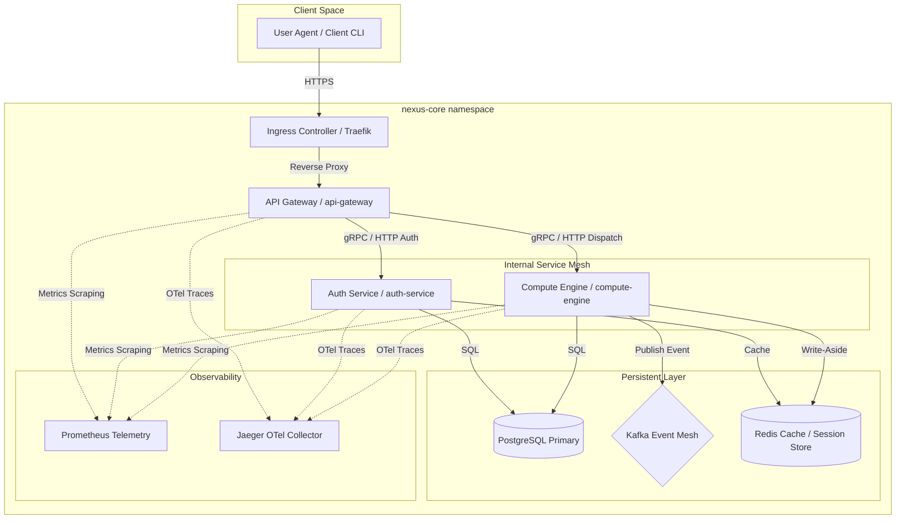

# System Architecture Specification (NexusCore)

This document outlines the system architecture of NexusCore, a high-throughput, low-latency, resilient enterprise distributed platform.

## 1. System Topology

NexusCore is deployed as a highly available, multi-region Kubernetes cluster. Below is the comprehensive architectural data flow across Client Space, Ingress, Internal Mesh, Caching, Event-Driven, and Telemetry tiers.

## 2. Microservice Design & Responsibilities

### 2.1 API Ingress Gateway (`api-gateway`)
*   **Language**: Go (v1.22+)
*   **Port**: `8080` (HTTP)
*   **Role**: Handles Edge Ingress, CORS, TLS termination, Rate Limiting, and JWT Verification.
*   **Design Pattern**: Non-blocking asynchronous reverse proxy middleware chain.

### 2.2 Enterprise Authentication Service (`auth-service`)
*   **Language**: Go (v1.22+)
*   **Port**: `8081` (gRPC/HTTP)
*   **Role**: Manages identity enrollment, security credentials hashing (using bcrypt), JWT creation, and session blacklists.
*   **Design Pattern**: Clean Architecture with repository pattern using PostgreSQL for credentials and Redis for session token invalidation.

### 2.3 Transaction & Compute Engine (`compute-engine`)
*   **Language**: Go (v1.22+)
*   **Port**: `8082` (gRPC/HTTP)
*   **Role**: Handles high-volume computations, ledger ledger updates, event logs processing.
*   **Design Pattern**: CQRS (Command Query Responsibility Segregation) with Event Sourcing. Publishes mutations to Kafka.

## 3. High Availability (HA) & Scaling

To guarantee an SLA of 99.99% availability, NexusCore deploys the following strategies:
*   **Horizontal Pod Autoscaling (HPA)**: Scaled dynamically based on CPU utilization (target 70%) and custom Prometheus Request-Per-Second (RPS) metrics.
*   **Pod Disruption Budgets (PDB)**: Confirms `minAvailable: 2` replicas during rolling node updates.
*   **Regional Multi-Zone Distribution**: Node affinity and anti-affinity rules isolate microservice replicas across different availability zones (e.g., `us-central1-a`, `us-central1-b`, `us-central1-c`).

## 4. Persistent Layer & Distributed State

### 4.1 Relational Database Schema (PostgreSQL)
The primary system of record for account and credential states uses PostgreSQL 16. Database schema migrations are strictly managed via SQL migration scripts, ensuring zero-downtime rolling upgrades.

### 4.2 Event Mesh & Streaming (Apache Kafka)
All transaction mutations are emitted as immutable events to Kafka topics.
*   **Partitioning**: Account ID is utilized as the partition key, ensuring FIFO execution per account.
*   **Replication**: Topics are initialized with a replication factor of `3` and `min.insync.replicas=2` for durable write guarantees.

### 4.3 Cache & Transient State Store (Redis)
Deployed as a multi-node Redis Sentinel cluster.
*   **Write-Aside Caching**: Decreases PostgreSQL read contention by up to 85% for static metadata.
*   **Distributed Session Token Blocklist**: Replicated with an active TTL matching the token longevity bounds.
