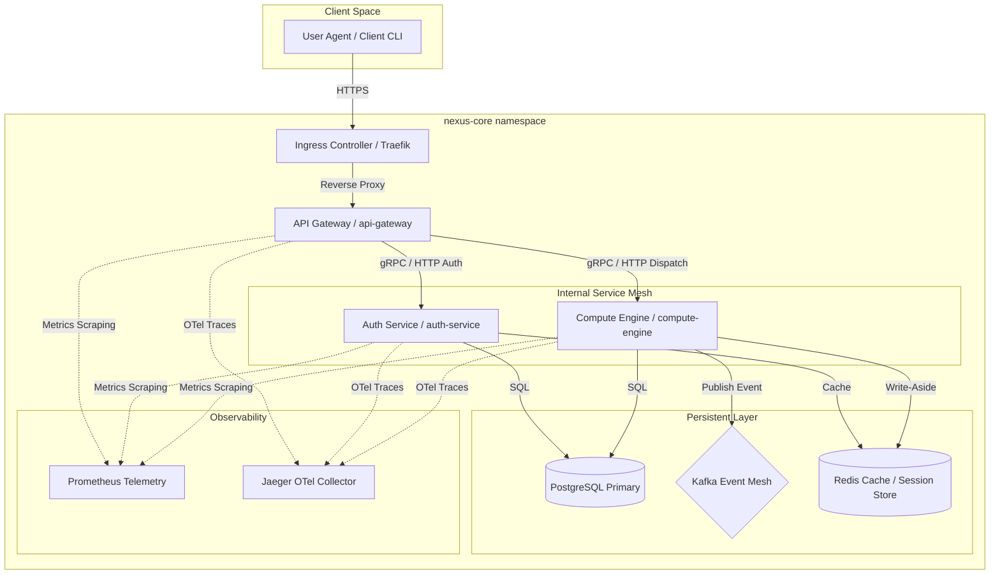

# Enterprise Distributed Platform Control Plane (NexusCore Workspace)

Welcome to the **NexusCore Enterprise Distributed Platform Workspace**. This repository contains a fully production-grade, multi-service Go workspace implementing the high-performance distributed architecture outlined in the system architecture designs.

It serves as a clean blueprint for modern high-throughput, low-latency microservice meshes with Zero-Trust configurations, Kafka asynchronous messaging, CQRS/Event-Sourcing, Distributed Tracing (OTel), Prometheus metrics, and automated Kubernetes orchestration.

---

## System Architecture Overview



---

## Active Modules & Microservices

1. **`api-gateway`** (Port `8080`):
   - Entry point for all external traffic. Handles reverse proxying, JWT signature verification, Global Rate Limiting, and CORS management.
   - Built with high-performance HTTP multiplexers and middleware layers.

2. **`auth-service`** (Port `8081`):
   - Handles enterprise user enrollment, secure credential hashing (bcrypt), and cryptographically signed JWT token distribution.
   - Uses PostgreSQL for state store and Redis for token blocklists.

3. **`compute-engine`** (Port `8082`):
   - Processes complex transactions and business events using CQRS (Command Query Responsibility Segregation) and Event-Sourcing.
   - Publishes state changes as transactional events to Kafka topics for asynchronous ledger synchronization.

---

## Getting Started

### Prerequisites
Make sure you have the following installed on your machine:
- **Go** (version 1.22+)
- **Docker** & **Docker Compose**
- **Make** (build utility)

### Local Deployment
Spin up the entire enterprise infrastructure (PostgreSQL, Kafka, Redis, Prometheus, Jaeger, and all three microservices) with a single command:

```bash
make up
```

This will:
1. Compile and build all Go microservice multi-stage scratch Docker images.
2. Launch database instances, event brokers, and caching clusters.
3. Establish default schemas, credentials, and message topics.
4. Bootstrap telemetry collectors and scraping paths.

### Verification endpoints
- **API Gateway Entry**: `http://localhost:8080/transactions`
- **Auth Endpoint**: `http://localhost:8081/api/v1/auth/login`
- **Prometheus Dashboard**: `http://localhost:9090`
- **Jaeger UI**: `http://localhost:16686`

---

## Project Structure

```
.
├── .gitignore
├── LICENSE
├── Makefile
├── README.md
├── api-gateway/            # Go Module: API Gateway
├── auth-service/           # Go Module: Authentication Service
├── compute-engine/         # Go Module: Transaction & Compute Engine
├── config/                 # Static Configuration Manifests
│   └── prometheus.yml      # Prometheus Scraping configs
├── docker-compose.yml      # Infrastructure & Local Mesh orchestration
├── go.work                 # Multi-module Go Workspace controller
└── scripts/                # Setup & DB migrations
    └── bootstrap.sh        # Startup script
```

---

## Development commands

Refer to the root `Makefile` for the complete list of developer automation:
- `make build` - Build all microservices locally.
- `make test` - Execute unit tests across all workspace packages.
- `make down` - Terminate local environment and wipe volumes safely.
- `make ps` - Check telemetry health of running services.
